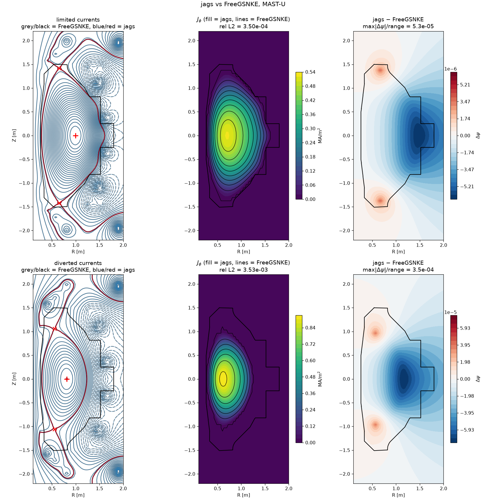

# jags

A minimal free-boundary Grad–Shafranov solver in JAX taking **exact Newton steps from an autodiff
Jacobian**, written as a foil to FreeGSNKE (finite-difference Newton–Krylov) and TokaMaker
(under-relaxed Picard).

> **Standalone experiment.** This lives in the FreeGSNKE tree for convenience but is not part of the
> `freegsnke` package, shares no code with it, and does not affect its build (the root
> `pyproject.toml` lists its packages explicitly). FreeGSNKE is used only as a cross-check
> reference.

## Approach

The GS source is `Jtor = R·p'(ψ) + FF'(ψ)/(μ₀R)`. Codes in this family write the profiles on
*normalised* flux over the plasma core, so every residual evaluation must first find the magnetic
axis, the boundary flux and the core region — in FreeGSNKE by contour tracing and
`Path.contains_points` (`freegsnke/jtor_update.py:136-269`), which is neither JAX-traceable nor
differentiable.

jags writes the profiles on **unnormalised ψ with compact support**, so the plasma region is the
level set `{ψ > ψ_edge}` and falls out of the solution instead of being detected. The residual is
then smooth by construction with no smoothing parameters, and `jax.jvp` gives the exact Jacobian
action. Profiles are given as physical `p(ψ)` and `F(ψ)`; `p'` and `FF' = ½d(F²)/dψ` come from
`jax.grad`, so they cannot disagree.

A level set alone is not enough for a **diverted** plasma — it also contains lobes beyond a null.
`reach.py` fixes this by replacing ψ with its running minimum along the ray from the magnetic axis:
inside the core the minimum is at the ray's endpoint so ψ is unchanged, while a lobe is only
reachable by dipping below `ψ_edge`. It assumes only that the core is star-shaped about the axis,
which holds for single/double null, Super-X, snowflake and negative triangularity alike.

The same device gives **differentiable flux-surface averages** (`fsa.py`), which a transport solver
such as TORAX needs as `int_dl_over_Bp`, `⟨1/R²⟩`, `⟨|∇ψ|²⟩` and friends. Computed conventionally
each is a contour integral, reintroducing exactly the tracing this package avoids. The co-area
formula turns them into ratios of *volume* integrals, `⟨X⟩ = Σwᵢxᵢ / Σwᵢ` with
`wᵢ = 2πRᵢ δ_ε(ψᵢ − ψ₀) dA` — one weighted sum over the grid, no contour, smooth in ψ. For a
diverted plasma the level sets must be taken from the reachability rather than from ψ, or the kernel
sums over the divertor legs too; `surfaces(..., label=m)` does that, keeping `|∇ψ|` physical.

Three things decide whether it is accurate, and all three matter. The kernel width is set in
**cells** (a multiple of the flux change across one cell along `∇ψ`, by a fixed point), not as a
fraction of the flux range, which is grid-blind. The kernel is **fourth order**, so the O(w²)
smearing of neighbouring surfaces cancels and the band can be a full cell wide; a Gaussian makes
`enclosed = Φ(u) + uφ(u)/2` the exact antiderivative of the delta, so `dV/dψ` stays the exact
derivative of `volume`. And the width is **capped near the edge**, where `|∇ψ|→0` at the X-point
would otherwise make a fixed flux band unboundedly wide in space.

Checked on the MAST-U diverted case against **two** contour-tracing codes — FreeGS4E's ray-traced
`q` and TORAX's `contourpy`-based eqdsk parser — on the same ψ:

| grid | jags vs FreeGS4E `q` | ψ_N ≤ 0.8 | FreeGS4E vs TORAX `q` |
|---|---|---|---|
| 65×65 | 3.7e-03 | 3.0e-02 | 2.2e-02 |
| 129×129 | 1.2e-03 | 5.1e-03 | 1.1e-02 |
| 193×193 | **1.2e-03** | **1.2e-03** | 9.4e-03 |

(median relative error). At 193×193 jags differs from TORAX by 8.8e-03 — *equal to* the
TORAX–FreeGS4E spread, so the comparison has hit the floor set by the references. On analytic
circular surfaces, where the truth is exact, the worst error over every quantity is 4.6e-04 / 3.1e-05
/ 6.8e-06 at 65/129/193.

The bundle reports `n_eff` (cells actually carrying a surface) and `n_cells` alongside the physics,
so a caller can tell which surfaces to extrapolate rather than believe: above `n_eff = 80` every
quantity is inside 1e-5, below 40 none is better than 1e-3.

## Results

Cross-checked against FreeGSNKE on MAST-U at 65×65 — identical grid, limiter, vacuum flux and
`Lao85` profile, with FreeGSNKE's own `psi_bndry` fed in as `ψ_edge`.

| coil currents | rel L2 ψ | rel L2 Jtor | Newton steps |
|---|---|---|---|
| `simple_limited_currents` | 9.40e-05 | 3.50e-04 | 8 |
| `simple_diverted_currents` | 6.38e-04 | 3.53e-03 | 4, quadratic |



Convergence is quadratic with undamped steps: `3.3e-3 → 1.2e-4 → 6.6e-7 → 1.5e-12`. The GS equation
is satisfied to 6e-13, the free-boundary condition to 8e-13, and the analytic Solov'ev solution is
recovered to 1e-10.

**The residual error is entirely the plasma mask.** Given FreeGSNKE's *own* core mask, jags
reproduces it to **2.6e-09** (limited) and **2.1e-09** (diverted) — its own convergence floor. The
gap above comes from a one-cell disagreement about which cells are plasma: FreeGSNKE decides with a
point-in-polygon test on a traced contour, jags with a level set. It does not shrink with
resolution (8.99e-3 → 1.19e-3 → 3.53e-3 at 33/49/65) because it is quantisation, not discretisation
error, so ~1e-4 is the floor for this comparison.

## Layout

```
jags/
  grid.py       R-Z grid, limiter polygon, point-in-polygon mask
  operators.py  4th-order Delstar (matching GSsparse4thOrder), dense inverse, Green's functions
  interp.py     Catmull-Rom bicubic: value, gradient, Hessian (C1, so inner Newton converges)
  profiles.py   p(psi) and F(psi); p' and FF' by autodiff. compact() and lao85()
  reach.py      running minimum along the ray from the axis -- the diverted-plasma fix
  jacobian.py   matrix-free GMRES step, and a chunked dense Jacobian as reference
  solver.py     residual, Picard warm-up, exact Newton with Armijo; make_solver compiles once
  critical.py   diagnostics only: axis by implicit function theorem, soft-max boundary flux
  fsa.py        flux-surface averages by the co-area formula -- no contour tracing
scripts/
  dump_freegsnke_case.py   run in the FreeGSNKE venv -> .npz + .geqdsk reference
  compare.py               re-solve, report metrics, write the figure
  check_fsa_torax.py       run in the TORAX venv -> its eqdsk parser's own FSAs
  check_fsa.py             flux-surface averages vs both tracing codes
```

Everything geometry-only is precomputed in NumPy/SciPy and frozen as constants, so **JAX never needs
elliptic integrals**.

## Usage

```python
grid    = Grid(Rmin, Rmax, Zmin, Zmax, nR, nZ, limiter)
machine = solver.build_machine(grid, coil_RZ)
profile = profiles.compact(psi_edge, psi_scale, p0, fvac)
run     = solver.make_solver(machine, profile, psi_coil, Ip=6.2e5,
                             reachability=reach.make_reachability(grid))
result  = run(solver.initial_guess(machine, centre, radii, Ip))
```

`make_solver` compiles once and can be called repeatedly (4.1 s vs 10.6 s per solve at 65×65);
`solve` is a one-shot wrapper that recompiles. `jacobian_mode` is `"matrix_free"` (default, GMRES on
the Jacobian action) or `"jacfwd"` (dense, the reference the tests check against).

## Running it

Two virtualenvs — FreeGS4E needs `numpy<2`, modern JAX wants `numpy>2`. They exchange `.npz` files.

```bash
uv venv --python 3.12 .venv
uv pip install --python .venv/bin/python jax jaxlib numpy scipy pytest matplotlib
uv venv --python 3.10 ../.venv-freegsnke
uv pip install --python ../.venv-freegsnke/bin/python "freegs4e>=0.11" -e ..   # the repo root

PYTHONPATH=. .venv/bin/python -m pytest tests -q     # 51 tests
PYTHONPATH=. .venv/bin/python scripts/compare.py     # reference .npz files are committed
PYTHONPATH=. .venv/bin/python scripts/check_fsa.py   # flux-surface averages

# to regenerate the reference equilibria (needs the FreeGSNKE venv, and must not
# run from the repo root or the local package shadows the installed one). The
# trailing argument is the grid size; the convergence study in fsa.py used 129
# and 193, which are left in /tmp rather than committed:
cd /tmp && ../.venv-freegsnke/bin/python <repo>/jags/scripts/dump_freegsnke_case.py \
    <repo>/jags/scripts/case_diverted.npz diverted 65

# the TORAX reference needs a third venv, since TORAX pins numpy>2 and its own
# deps; only its eqdsk parser is used, on the .geqdsk written above
<torax>/.venv/bin/python scripts/check_fsa_torax.py \
    scripts/case_diverted.geqdsk /tmp/torax_diverted_65.npz
PYTHONPATH=. .venv/bin/python scripts/check_fsa.py --all
```

`jax.config.update("jax_enable_x64", True)` is required — in float32 Newton stalls near 1e-4.

The `theo-brown/freegs4e` fork is **behind** what `freegsnke` main needs — it lacks
`GeneralPprimeFFprime`, which `freegsnke/jtor_update.py:858` imports at module scope — so the two
checkouts cannot be installed together. The commands above take `freegs4e` from PyPI instead.

## Limitations

- **Forward solves only.** No shape targets, no coil-current optimisation, no time stepping.
- **Star-shaped core** assumed by `reach.py`; a strongly indented boundary would violate it.
- **Dense O(N³) linear algebra** in the residual (`A⁻¹` is a dense N×N, 2.2 GB at 129×129). The
  Newton step itself is matrix-free, so the residual is now the binding constraint.
- **X-point diagnostics** seed one saddle above and below the axis; multi-X-point configurations are
  out of scope. `critical.boundary_flux` also maximises over the whole limiter contour where
  FreeGSNKE restricts to cells adjacent to the core — pass `use_limiter=False` when diverted.
- Two subtleties are documented in test docstrings rather than here: `lax.pow` returns a NaN *second*
  derivative at zero (`test_lao85_second_derivative_is_finite`), and differentiating through
  `jnp.clip` halves `p'` at exactly `ψ_axis` (`test_lao85_endpoint_derivative_is_averaged`).
